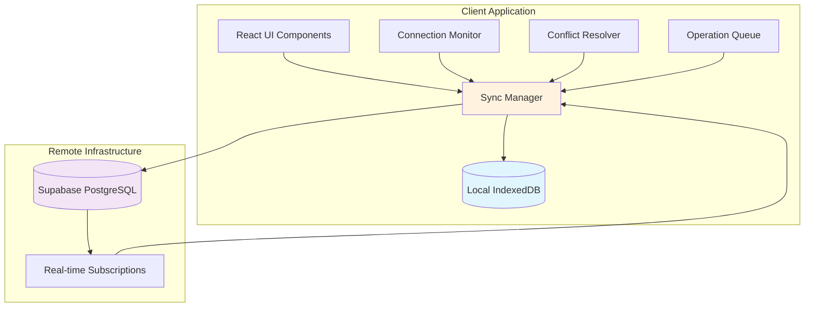
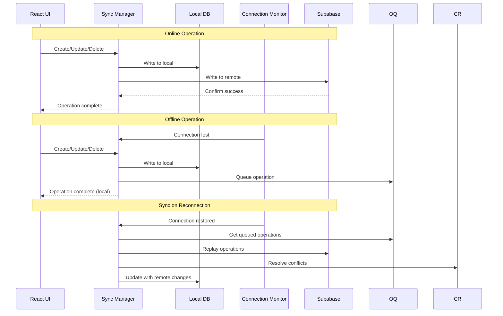

# Design Document: Offline-First Sync Capability

## Overview

The Offline-First Sync Capability transforms the automobile showroom management system into a resilient, offline-capable application that maintains full functionality during internet outages. This design implements a comprehensive local database synchronization system with Supabase, ensuring business continuity for automobile service centers operating in environments with unreliable internet connectivity.

The system employs a dual-database architecture where a local IndexedDB database mirrors the remote Supabase PostgreSQL database, enabling seamless offline operations with automatic synchronization when connectivity is restored. The design prioritizes data consistency, conflict resolution, and user experience continuity across online/offline transitions.

## Architecture

### High-Level Architecture



### Component Architecture

The offline sync capability is built around five core components:

1. **Sync Manager**: Central orchestrator that coordinates all synchronization activities
2. **Local Database**: IndexedDB-based storage that mirrors the Supabase schema
3. **Connection Monitor**: Real-time connectivity detection and status management
4. **Conflict Resolver**: Handles data conflicts between local and remote changes
5. **Operation Queue**: Manages offline operations for replay during synchronization

### Data Flow Architecture



## Components and Interfaces

### Sync Manager

The Sync Manager serves as the central coordination point for all data operations and synchronization activities.

**Interface:**
```typescript
interface SyncManager {
  // Core operations
  initialize(): Promise<void>
  sync(): Promise<SyncResult>
  
  // Data operations
  create<T>(table: string, data: T): Promise<T>
  read<T>(table: string, query?: Query): Promise<T[]>
  update<T>(table: string, id: string, data: Partial<T>): Promise<T>
  delete(table: string, id: string): Promise<void>
  
  // Status and events
  getStatus(): SyncStatus
  onStatusChange(callback: (status: SyncStatus) => void): void
  onConflict(callback: (conflict: Conflict) => void): void
}

interface SyncResult {
  success: boolean
  operations: number
  conflicts: Conflict[]
  errors: SyncError[]
}

interface SyncStatus {
  connected: boolean
  syncing: boolean
  lastSync: Date | null
  pendingOperations: number
  conflicts: number
}
```

**Implementation Strategy:**
- Singleton pattern to ensure single source of truth
- Event-driven architecture for status updates
- Automatic retry mechanism with exponential backoff
- Transaction-based operations for data consistency

### Local Database (IndexedDB)

The local database provides a complete mirror of the Supabase schema using IndexedDB for browser-based persistence.

**Schema Design:**
```typescript
interface LocalSchema {
  clients: {
    id: number
    name: string
    phone: string
    email?: string
    since: string
    created_at: string
    _sync_status: 'synced' | 'pending' | 'conflict'
    _last_modified: string
    _version: number
  }
  
  cars: {
    id: number
    plate: string
    make: string
    model: string
    year: number
    color?: string
    client_id: number
    created_at: string
    _sync_status: 'synced' | 'pending' | 'conflict'
    _last_modified: string
    _version: number
  }
  
  services: {
    id: number
    plate: string
    type: string
    date: string
    next_due?: string
    cost: number
    status: string
    tech?: string
    notes?: string
    created_at: string
    _sync_status: 'synced' | 'pending' | 'conflict'
    _last_modified: string
    _version: number
  }
  
  appointments: {
    id: number
    plate: string
    client_id: number
    date: string
    time: string
    type: string
    status: string
    created_at: string
    _sync_status: 'synced' | 'pending' | 'conflict'
    _last_modified: string
    _version: number
  }
  
  // Metadata tables
  sync_metadata: {
    table_name: string
    last_sync: string
    checksum: string
  }
  
  operation_queue: {
    id: string
    table_name: string
    operation: 'create' | 'update' | 'delete'
    data: any
    timestamp: string
    retry_count: number
  }
}
```

**Key Features:**
- Automatic schema versioning and migration
- Optimistic locking with version numbers
- Sync status tracking per record
- Checksum-based integrity verification

### Connection Monitor

Real-time connectivity detection with intelligent reconnection strategies.

**Interface:**
```typescript
interface ConnectionMonitor {
  isOnline(): boolean
  getConnectionQuality(): 'good' | 'poor' | 'offline'
  startMonitoring(): void
  stopMonitoring(): void
  onStatusChange(callback: (status: ConnectionStatus) => void): void
}

interface ConnectionStatus {
  online: boolean
  quality: 'good' | 'poor' | 'offline'
  supabaseReachable: boolean
  lastCheck: Date
}
```

**Implementation Strategy:**
- Multiple detection methods: navigator.onLine, fetch probes, WebSocket heartbeat
- Supabase-specific connectivity testing
- Adaptive polling intervals based on connection history
- Background connectivity restoration attempts

### Conflict Resolver

Handles data conflicts when the same record is modified both offline and online.

**Interface:**
```typescript
interface ConflictResolver {
  detectConflicts(localData: any[], remoteData: any[]): Conflict[]
  resolveConflict(conflict: Conflict, strategy: ResolutionStrategy): Resolution
  applyResolution(resolution: Resolution): Promise<void>
}

interface Conflict {
  id: string
  table: string
  recordId: string
  localVersion: any
  remoteVersion: any
  conflictType: 'update-update' | 'update-delete' | 'delete-update'
  timestamp: Date
}

interface Resolution {
  action: 'use-local' | 'use-remote' | 'merge' | 'manual'
  data: any
  metadata: {
    strategy: ResolutionStrategy
    timestamp: Date
    user?: string
  }
}

type ResolutionStrategy = 'last-write-wins' | 'manual' | 'field-level-merge'
```

**Resolution Strategies:**
1. **Last-Write-Wins**: Automatic resolution based on modification timestamps
2. **Manual Resolution**: Present both versions to user for decision
3. **Field-Level Merge**: Intelligent merging of non-conflicting fields

### Operation Queue

Manages offline operations for reliable replay during synchronization.

**Interface:**
```typescript
interface OperationQueue {
  enqueue(operation: QueuedOperation): Promise<void>
  dequeue(): Promise<QueuedOperation | null>
  peek(): Promise<QueuedOperation[]>
  clear(): Promise<void>
  getCount(): Promise<number>
}

interface QueuedOperation {
  id: string
  table: string
  operation: 'create' | 'update' | 'delete'
  data: any
  timestamp: Date
  retryCount: number
  dependencies?: string[]
}
```

**Key Features:**
- FIFO ordering with dependency resolution
- Automatic retry with exponential backoff
- Operation deduplication and optimization
- Persistent storage across application restarts

## Data Models

### Enhanced Data Models with Sync Metadata

All data models are extended with synchronization metadata to support offline operations:

```typescript
interface SyncMetadata {
  _sync_status: 'synced' | 'pending' | 'conflict'
  _last_modified: string
  _version: number
  _local_id?: string  // For offline-created records
}

type ClientWithSync = Client & SyncMetadata
type CarWithSync = Car & SyncMetadata
type ServiceWithSync = Service & SyncMetadata
type AppointmentWithSync = Appointment & SyncMetadata
```

### Sync State Management

```typescript
interface SyncState {
  tables: {
    [tableName: string]: {
      lastSync: Date
      checksum: string
      pendingOperations: number
      conflicts: number
    }
  }
  global: {
    initialized: boolean
    lastFullSync: Date
    totalPendingOperations: number
    connectionStatus: ConnectionStatus
  }
}
```

## Correctness Properties

*A property is a characteristic or behavior that should hold true across all valid executions of a system-essentially, a formal statement about what the system should do. Properties serve as the bridge between human-readable specifications and machine-verifiable correctness guarantees.*

Before defining the correctness properties, I need to analyze the acceptance criteria to determine which are suitable for property-based testing.

### Property Reflection

After analyzing all acceptance criteria, I identified several areas where properties can be consolidated to eliminate redundancy:

**Consolidation Analysis:**
- Properties 1.3, 1.4, and 8.1 all test CRUD operations working correctly - these can be combined into a comprehensive offline CRUD property
- Properties 2.2 and 2.3 both test timing constraints during sync - these can be combined into a sync timing property
- Properties 4.1, 4.2, and 4.4 all test operation queuing behavior - these can be combined into a comprehensive queue management property
- Properties 6.1, 6.2, and 6.5 all test UI status display - these can be combined into a status display property
- Properties 7.1, 7.3, and 7.4 all test data integrity - these can be combined into a comprehensive integrity property
- Properties 10.3 and 10.4 both test export/import round-trip - these can be combined into a data portability property

**Final Property Set:**
After consolidation, the following properties provide comprehensive coverage without redundancy:

### Property 1: Offline CRUD Operations

*For any* valid data record and any CRUD operation, the local database SHALL execute the operation successfully when offline and produce the same result as when online

**Validates: Requirements 1.3, 1.4, 8.1**

### Property 2: Operation Queue Management

*For any* sequence of offline operations, the operation queue SHALL capture all operations with timestamps, maintain chronological order, and replay them correctly upon reconnection

**Validates: Requirements 4.1, 4.2, 4.4, 4.5**

### Property 3: Data Persistence

*For any* data stored locally, the information SHALL persist across application restarts and browser sessions without loss

**Validates: Requirements 1.5, 4.3**

### Property 4: Conflict Resolution

*For any* conflicting record modifications, the conflict resolver SHALL detect the conflict and apply last-write-wins resolution based on timestamps without data loss

**Validates: Requirements 3.1, 3.2, 3.4, 3.5**

### Property 5: Sync Timing Constraints

*For any* synchronization operation, queued operations SHALL upload within 30 seconds and remote changes SHALL download within 60 seconds of connection restoration

**Validates: Requirements 2.2, 2.3**

### Property 6: Connection State Management

*For any* connection state change, the connection monitor SHALL notify components within 5 seconds and the UI SHALL display the correct status with appropriate color coding

**Validates: Requirements 5.2, 6.1, 6.2, 6.5**

### Property 7: Data Integrity Verification

*For any* synchronization cycle, the data consistency manager SHALL verify integrity through checksums and validation, triggering resync when inconsistencies are detected

**Validates: Requirements 7.1, 7.3, 7.4**

### Property 8: Sync Operation Blocking

*For any* write operation attempted during synchronization, the sync engine SHALL prevent or queue the operation to avoid conflicts

**Validates: Requirements 2.4**

### Property 9: Retry Mechanism

*For any* failed synchronization attempt, the sync engine SHALL retry with exponential backoff up to 5 times

**Validates: Requirements 2.5**

### Property 10: Initial Sync Prioritization

*For any* initial synchronization with mixed data criticality, the sync engine SHALL prioritize critical data (active appointments, recent services) and resume from checkpoints if interrupted

**Validates: Requirements 9.3, 9.4**

### Property 11: User Context Preservation

*For any* online/offline transition, the application SHALL maintain user context, current screen, and provide identical functionality in both modes

**Validates: Requirements 8.2, 8.3, 8.4**

### Property 12: Offline Search Capability

*For any* search query on locally stored data, the application SHALL return accurate results when offline

**Validates: Requirements 8.5**

### Property 13: Data Export/Import Round-trip

*For any* dataset exported to JSON format, importing the exported data SHALL restore the original dataset completely

**Validates: Requirements 10.3, 10.4**

## Error Handling

### Error Categories and Strategies

**Network Errors:**
- Connection timeouts: Automatic retry with exponential backoff
- Supabase service unavailable: Fallback to local operations with queuing
- Partial sync failures: Resume from last successful checkpoint

**Data Errors:**
- Corruption detection: Automatic restoration from backup
- Schema mismatches: Automatic migration or full resync
- Constraint violations: Conflict resolution with user notification

**Storage Errors:**
- IndexedDB quota exceeded: Data cleanup with user consent
- Browser storage cleared: Automatic backup recovery attempt
- Backup corruption: Fallback to remote data restoration

**Sync Errors:**
- Conflict resolution failures: Manual user intervention
- Operation replay failures: Individual operation retry with logging
- Checksum mismatches: Full table resynchronization

### Error Recovery Mechanisms

```typescript
interface ErrorRecovery {
  // Automatic recovery strategies
  retryWithBackoff(operation: () => Promise<any>, maxRetries: number): Promise<any>
  restoreFromBackup(table: string): Promise<void>
  resyncTable(table: string): Promise<void>
  
  // User-assisted recovery
  promptManualResolution(conflict: Conflict): Promise<Resolution>
  requestStorageCleanup(requiredSpace: number): Promise<boolean>
  
  // Logging and monitoring
  logError(error: SyncError): void
  reportHealthMetrics(): HealthMetrics
}
```

## Testing Strategy

### Dual Testing Approach

The offline sync capability requires both unit tests for specific scenarios and property-based tests for comprehensive input coverage:

**Unit Tests Focus:**
- Specific error conditions and edge cases
- Integration points between components
- UI behavior during state transitions
- Network failure simulation scenarios

**Property-Based Tests Focus:**
- Universal properties across all valid inputs
- Comprehensive data variation through randomization
- Stress testing with large datasets
- Concurrent operation scenarios

### Property Test Configuration

**Test Framework:** Fast-check (JavaScript property-based testing library)
**Minimum Iterations:** 100 per property test
**Test Environment:** Jest with IndexedDB polyfill and Supabase mocking

**Property Test Tags:**
Each property test references its design document property:
- **Feature: offline-sync-capability, Property 1**: Offline CRUD Operations
- **Feature: offline-sync-capability, Property 2**: Operation Queue Management
- **Feature: offline-sync-capability, Property 3**: Data Persistence
- [Continue for all 13 properties...]

### Integration Testing Strategy

**Mock Strategy:**
- Supabase client mocked for offline simulation
- IndexedDB operations tested with real browser APIs
- Network conditions simulated through service worker

**Test Scenarios:**
- Initial application setup and data download
- Extended offline periods with heavy usage
- Frequent online/offline transitions
- Large dataset synchronization
- Multiple concurrent user sessions

### Performance Testing

**Benchmarks:**
- Initial sync completion time (target: <5 minutes for typical datasets)
- Offline operation response time (target: equivalent to online)
- Sync operation throughput (target: 1000 operations/minute)
- Memory usage during large syncs (target: <100MB additional)

**Load Testing:**
- 10,000+ queued operations
- 1GB+ local database size
- 100+ concurrent conflicts
- Extended offline periods (24+ hours)

## Implementation Phases

### Phase 1: Core Infrastructure (Weeks 1-2)
- Local database schema setup with IndexedDB
- Basic sync manager implementation
- Connection monitoring system
- Operation queue foundation

### Phase 2: Synchronization Engine (Weeks 3-4)
- Bidirectional sync implementation
- Conflict detection and resolution
- Retry mechanisms with exponential backoff
- Data integrity verification

### Phase 3: User Experience (Weeks 5-6)
- Status indicators and progress displays
- Error handling and user notifications
- Manual conflict resolution UI
- Offline capability indicators

### Phase 4: Advanced Features (Weeks 7-8)
- Backup and recovery system
- Data export/import functionality
- Performance optimizations
- Comprehensive testing and validation

### Phase 5: Production Readiness (Weeks 9-10)
- Security hardening
- Performance tuning
- Documentation completion
- Deployment preparation

## Security Considerations

### Data Protection
- Local data encryption using Web Crypto API
- Secure key management for encryption
- Protection against XSS and injection attacks
- Audit logging for all data operations

### Authentication Handling
- Offline authentication token management
- Secure token refresh mechanisms
- Session persistence across offline periods
- Multi-device synchronization security

### Privacy Compliance
- Local data retention policies
- User consent for data storage
- Right to data deletion implementation
- GDPR compliance for EU users

## Performance Optimizations

### Sync Optimizations
- Incremental sync with change tracking
- Batch operations for efficiency
- Compression for large data transfers
- Smart conflict resolution caching

### Storage Optimizations
- Data deduplication strategies
- Automatic cleanup of old data
- Efficient indexing for fast queries
- Memory usage optimization

### Network Optimizations
- Request batching and coalescing
- Adaptive sync frequency based on usage
- Background sync during idle periods
- Bandwidth-aware sync strategies

## Monitoring and Observability

### Metrics Collection
- Sync success/failure rates
- Operation queue lengths
- Conflict resolution statistics
- Performance timing metrics

### Health Monitoring
- Database integrity checks
- Storage usage monitoring
- Network connectivity quality
- User experience metrics

### Alerting System
- Critical sync failures
- Data corruption detection
- Storage quota warnings
- Performance degradation alerts